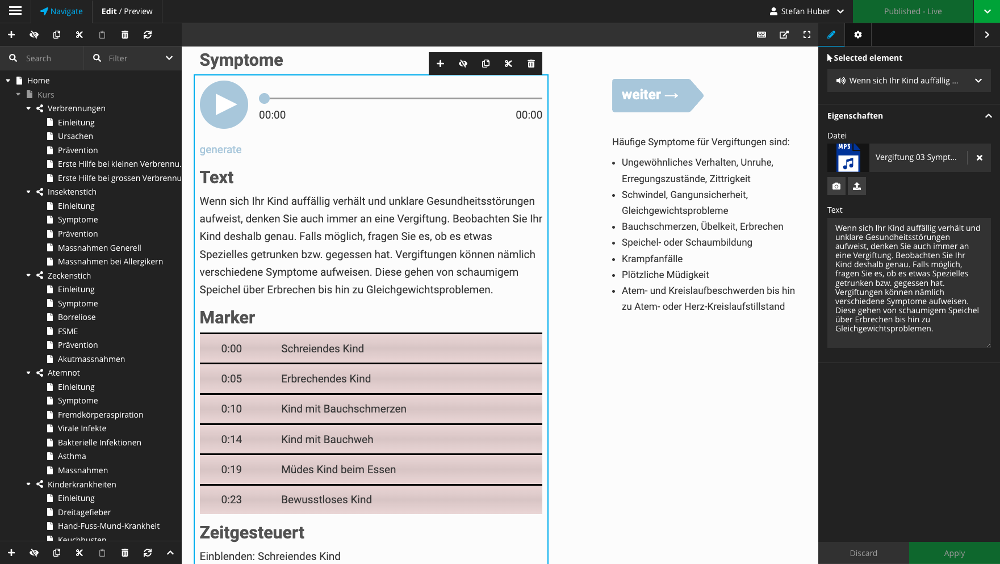
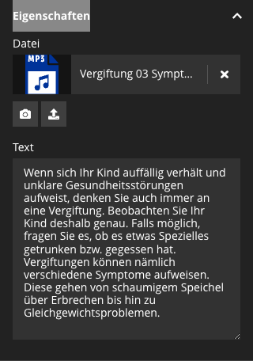

```fm
style: negative
background: true
```

## Hello _👋_

# {{process.content.frontmatter.title}}

_some examples and what to do with it_

<footer>

2022 · Stefan Huber</small>

</footer>

--s--

```fm
style: image
class: text-shadow
background:
  image: https://portrait.signalwerk.ch/illustration/2020/rgb/w4000/stefan-huber.jpg
  position: 50% 40%
```

## Stefan

<div class="box box--w40p box--bottom box--white box--padding small">

- Developer
- half a designer
- half a teacher

</div>

<footer class="footer--right">

Illustration by [Benjamin Güdel](http://www.guedel.biz/) · 2020

</footer>

--s--

## What's this talk about?

# _Text to speech_ (TTS)<br> also called _Speech synthesis_

- Examples and where we stand in 2022
- Don't ask me how this works

--s--

## What is it?

# Convert _text_ to an _audio voice_

--s--

## Is it hard?

# _No_. But _Yes_.

--s--

## The easy part

# You can produce a <br> _robotic voice_ since many decades

--s--

## The hard part

# Make it sound _like a human_

--s--

```fm
style: negative
background: true
```

## What is the level of reality? <!-- Wie hoch ist der Realitätsgrad? -->

# Uncanny valley

--s--

## Is this a human?


<footer>

Source: [Wikipedia](https://en.wikipedia.org/wiki/Homer_Simpson)

</footer>

</footer>

--s--

## Can you relate?


<footer>

Source: [Wikipedia](https://en.wikipedia.org/wiki/Uncanny_valley)

</footer>

--s--

## Uncanny valley


<footer>

Source: [Wikipedia](https://en.wikipedia.org/wiki/Uncanny_valley)

</footer>
--s--

```fm
style: negative
background: true
```

## Let's hear it!

# Examples

--s--

## DECtalk · 1984

### Text

<audio controls src="https://upload.wikimedia.org/wikipedia/commons/c/c7/DECtalk_demo.flac">
Your browser does not support the <code>audio</code> element.
</audio>

---

### Song

<audio controls src="https://upload.wikimedia.org/wikipedia/commons/8/8f/Daisy_Bell_sung_by_DECtalk.flac">
Your browser does not support the <code>audio</code> element.
</audio>

<footer>

Source: [Wikipedia](https://en.wikipedia.org/wiki/DECtalk)

</footer>

--s--

```fm
style: negative
background: true
```

## Example · 2019

# Learning platform

--s--

## Sketch in backend



--s--

## Write text



--s--

## Test audio with TTS

<audio controls src="media/2019-may/d4ab1b4194e27d0b334aa22f47cedf59.mp3">
Your browser does not support the <code>audio</code> element.
</audio>

--s--

## Finally implement with speaker

<audio controls src="media/2019-may/Vergiftung%2003%20Symptome.mp3">
Your browser does not support the <code>audio</code> element.
</audio>

--s--

```fm
style: negative
background: true
```

## Technology

# Behind the scenes

--s--

## How to do it?

- Subscribe to a speech API
- Convert Text to [SSML](https://www.w3.org/TR/speech-synthesis11/)
- Send SSML to Service and get Audio

--s--

## Why API?

- It's a hard problem
- Service is super cheap

--s--

## APIs

- Amazon
- Google
- Microsoft
- Watson (IBM)
- ...

--s--

## Cost

Example [Microsoft](https://azure.microsoft.com/en-us/pricing/details/cognitive-services/speech-services/) with neural voice;

- $16 per 1M characters

--s--

## SSML

#### Speech Synthesis Markup Language

There is a standard how to tell the machine how to say stuff. It's called [SSML](https://www.w3.org/TR/speech-synthesis11/)

--s--

```fm
style: negative
background: true
```

## Why?

# SSML is cool!

--s--

## Different voices

```xml
<voice name="en-US-GuyNeural">
    Text
</voice>
```

--s--

## Adjust voice

```xml
<voice name="en-US-GuyNeural">
    <mstts:express-as style="newscast" >
        Text
    </mstts:express-as>
</voice>
```

--s--

## Adjust voice

```xml
<voice name="en-US-GuyNeural">
    <mstts:express-as style="newscast" >
        <prosody rate="5%" pitch="0%" volume="60">
            Text
        </prosody>
    </mstts:express-as>
</voice>
```

--s--

## Dates

```xml
<speak>
  <say-as interpret-as="date" format="yyyymmdd">
    1960-09-10
  </say-as>
</speak>
```

--s--

## Pronounce characters

```xml
The mp3 files
```

```xml
The
<say-as interpret-as="characters">thx</say-as>
files
```

--s--

## Give it a break…

```xml
<break time="100ms" />
```

--s--

## Get Audio

- API with POST-Request
- SDK-Libraries (more information)

--s--

```fm
style: negative
background: true
```

## Example · 2022

# Parser · Podcast

--s--

## Examples in swiss german

<audio controls src="media/2022-feb/hello.mp3">
Your browser does not support the <code>audio</code> element.
</audio>

--s--

## Episode 00

<audio controls src="media/2022-feb/00-episode-zero.mp3">
Your browser does not support the <code>audio</code> element.
</audio>

- [Live](https://azure.microsoft.com/en-us/services/cognitive-services/text-to-speech/#features)
  --s--

## Problems

- Attributions
- Copyrights
- Ethical concerns

--s--

## exit 0; thx

# Questions?
